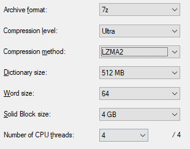
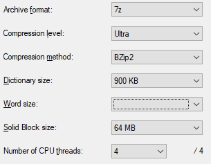

## Introduction

I only started photography as a hobby about a year ago, and already I  have about 50gb in my photo library. I shoot RAW, and evidently RAW  photos take up a lot of space. I decided to test whether it was possible to compress these files to save space. Specifically, I wanted to know  if I could use a compressed archive, like a ZIP file, to reduce the size on disk of my photo library.

 I'd like to specify that I'm a Nikon user; all of my RAW files are in  the 14-bit NEF format from a Nikon D5600. Each file takes up about 25mb.

 There are only a few different lossless [general purpose compression](https://en.wikipedia.org/wiki/Lossless_compression#General_purpose) algorithms. There's a few buzzwords in there, but basically that means programs  that will compress any given file where the original file is  recoverable, no data is lost.

 There are 3 commonly used algorithms: bzip, gzip, and lzma. I ignored  gzip since gzip is optimized for speed and not size. I ran a variation  of bzip and lzma on 3 sets of 10 NEF files to determine how much space I could potentially save if I compressed all my photos.

## Procedure

I used the 7z utility (version 16.03 [64-bit]) on Windows 10. First I tried LZMA2 with the following settings:

|  |
| ------------------------------------------------------------ |
|                                                              |

I then tried with BZIP2 with the following settings:

| |
| ------------------------------------------------------------ |
|                                                              |

*Note that the 'archive format' is inconsequential, it is just a  container for the compressed data. If you're thinking "Hey, what about  '.zip' or '.tar' or '.rar'?" It's because those are all container  formats and not compression algorithms.*

I ran this over 3 sets of 10 NEF files. Here is the result:

|                   | Uncompressed | LZMA2 | BZIP2 |
| ----------------- | ------------ | ----- | ----- |
| Set 1             | 267          | 263   | 262   |
| Set 2             | 242          | 234   | 233   |
| Set 3             | 264          | 255   | 255   |
| Average           | 258          | 251   | 250   |
| Compression Ratio | 100%         | 97%   | 97%   |

All number are in MB (except for compression ratio). Compression ratio  represents the ratio of the original to the compressed file, lower is  better.

LZMA took about a minute to compress while BZIP took about five minutes.

## Conclusion

The compression achievable is negligible. I could shave off a few  megabytes from my photo library, but then I would need to uncompress  them to access them. The inconvenience outweighs the savings.

Compression isn't viable for NEF files likely because they are [already compressed](http://regex.info/blog/photo-tech/nef-compression). There is a [limit](https://stackoverflow.com/questions/3261685/what-is-the-maximum-theoretically-possible-compression-rate) in how much a file can be compressed without losing data, and successive lossless compression usually wont accomplish anything.

But, there is another way. So far I've been focusing on lossless compression but you can also use [*lossy* compression](https://en.wikipedia.org/wiki/Lossy_compression). Lossy means some data is lost in the compression as a compromise to  save space. You may not realize that you likely already use lossy  compression in your normal photo production workflow.

 Filetypes like .jpeg and .png both have built-in lossy compression  algorithms. The compression used in these filetypes are specialized for  images and works to reduce the data you don't see.

 Typically my RAW files are 25mb while a comparable JPEG would be 7mb.  That's a 28% compression ratio. I should note that even when I zoom in  there are no noticeable differences. Note that the compression in a JPEG file can be selected by a user, and the higher the compression the  lower the quality. I only start to notice quality loss as '[compression artifacts](https://en.wikipedia.org/wiki/Compression_artifact)' once the file is around 2mb and it only starts getting really ugly around 800kb (a compression ratio of 3%!).

 The main benefit of RAW files over a full quality JPEG is that the RAW  stores extra detail about highlights and lowlights. Normally this isn't  visible on screen, but this allows a photographer greater flexibility in editing without introducing ugly image artifacts. But this means that  If your image is finished and fully edited there is a lot of unneeded  detail stored in the RAW.

 If you need to save space on your photography portfolio, consider converting a few unimportant images to JPEG.
