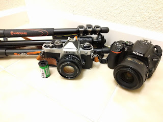
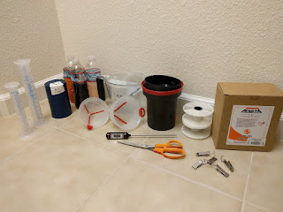
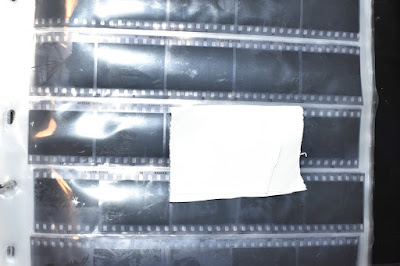
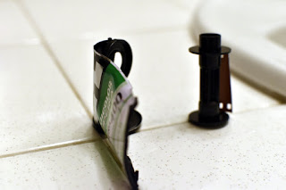
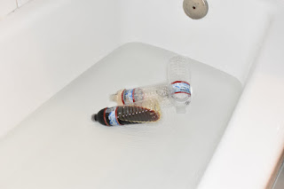
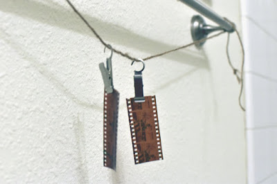

*If you aren't interested in the procedure and just want to see the results, skip to [part 2 (Results)](../1709_myth_color_film_cast_p2/index).*

## Introduction

It seems to be common consensus that when processing C41 (color  negative) film at home, you need to control the temperature of the  chemistry very carefully. I've heard that if your developer is off by  1℉, You're going to get some bad [color shifts](http://www.largeformatphotography.info/forum/archive/index.php/t-101217.html). Other [posts](https://www.photrio.com/forum/index.php?threads/c-41-effect-of-changing-temperature.37173/) claim 5℉ is the threshold. Looking around online, I've found many claims about color shifts, but no experimental results. One [post](https://www.photo.net/discuss/threads/time-temperature-chart-for-kodak-c-41-process.257953/) claimed that the color shifts are correctable in a digital workflow, but  otherwise if optically printing will be uncorrectable due to highlight  and shadow color shift being independent.

 The purpose of this experiment is to see how careful I need to be when controlling C41 chemistry temperature, and to visualize how serious the color shifts may be.

## Equipment

- 1 roll of film, [Fuji Superia 400](https://www.amazon.com/gp/product/B00004TWLZ/ref=as_li_tl?ie=UTF8&camp=1789&creative=9325&creativeASIN=B00004TWLZ&linkCode=as2&tag=expertprobabl-20&linkId=8100b1de70701021e0281524d6220520)
- 1 film camera, [Nikon FE2](https://www.keh.com/shop/nikon-fe2-chrome-35mm-camera-body.html) with [50mm f/1.8 Series E lens](https://www.keh.com/shop/50-f1-8-ser-e-ais-52-lens.html)
- 1 digital camera, [Nikon 5600](https://www.amazon.com/gp/product/B01N7OJNEX/ref=as_li_tl?ie=UTF8&camp=1789&creative=9325&creativeASIN=B01N7OJNEX&linkCode=as2&tag=expertprobabl-20&linkId=5e5f6ed0d1e43184636d56a863b62d5b) with [35mm f/1.8G](https://www.amazon.com/gp/product/B001S2PPT0/ref=as_li_tl?ie=UTF8&camp=1789&creative=9325&creativeASIN=B001S2PPT0&linkCode=as2&tag=expertprobabl-20&linkId=d79c7cf11752ea9a40b668bcd563c8d7) (Digital camera as a control)
- 1 tripod, [Vanguard VEO 204AB](https://www.amazon.com/gp/product/B00ZGY6U9K/ref=as_li_tl?ie=UTF8&camp=1789&creative=9325&creativeASIN=B00ZGY6U9K&linkCode=as2&tag=expertprobabl-20&linkId=980e473692a8500b505d4f19ab9883a2)
- 1 printed out color check page (effectively a [ColorChecker](https://en.wikipedia.org/wiki/ColorChecker))
- 1 film development hand tank, [Paterson Universal tank](https://www.amazon.com/gp/product/B0000BZMIH/ref=as_li_tl?ie=UTF8&camp=1789&creative=9325&creativeASIN=B0000BZMIH&linkCode=as2&tag=expertprobabl-20&linkId=bf769a5d45314f090c5a0438435eeeb8)
- 1 C41 Chemistry Kit, [Arista Quart C41 Chemical Kit](http://www.freestylephoto.biz/20411-Arista-C-41-Liquid-Color-Negative-Developing-Kit-1-Quart)
- 1 set of graduated cylindars, [Pixnor Graduated Cylinder Lab Set of 4](https://www.amazon.com/gp/product/B019W5T4CS/ref=as_li_tl?ie=UTF8&camp=1789&creative=9325&creativeASIN=B019W5T4CS&linkCode=as2&tag=expertprobabl-20&linkId=d7294910fdb5358d24290728aa9b923c)
- 2 funnels (two to prevent cross-contamination. One for developer, one for blix and stabilizer)
- 1 pair of scissors
- 1 tea tin to store undeveloped film
- 3 disposable water bottles to store chemicals

|  |
| :------------------------------------------------: |
|      All the gear needed to take the photos.       |

|  |
| :------------------------------------------------: |
|     All equipment needed to develop the film.      |

## Procedure

The rough idea was to fill up a roll of film with the same picture,  slice it into segments and develop each segment separately under  different parameters.

### Print out the Color Checker

I created the color grid using the [GIMP](https://www.gimp.org/) editor. The colors were chosen to roughly correspond to the color classes mentioned on the [ColorChecker Wikipedia page](https://en.wikipedia.org/wiki/ColorChecker). This was printed out on a standard laser jet printer and taped to a cardboard sheet for stability.

### Take the Pictures

For this, The film camera was set up on the tripod and a friend took 24  pictures successively. The digital camera was then set up on the tripod  and control pictures were taken. All pictures were taken at 1:25pm ± 10  minutes, on July 30th, 2017. All pictures were taken at f/8, 1/1000s,  ISO400, including the digital control. ISO was forced by the film speed I had, aperture was selected arbitrarily, and shutter speed was set by  using the recommended meter reading of the film camera. Both the film  camera and digital camera were set to manual mode.

### Segment The Film

In the dark, the film was extracted from the film canister and sliced  into roughly measured slices. There is one issue I needed to address:  until the film is developed, it is impossible to know where each frame  lies on the film. When loading the film into the camera, it could have  been offset by a bit. I worked around this by attempting to keep each  measure to roughly twice the length of a single frame; due to something  like [Nyquist's Theorem](https://www.quora.com/What-is-the-intuitive-meaning-of-the-Nyquist%E2%80%93Shannon-sampling-theorem-Why-is-it-that-the-sampling-frequency-has-to-be-greater-than-twice-of-the-message-signal-What-is-the-physical-meaning-and-significance-of-over-and-under-sampling), I'm guaranteed to get at least one complete frame per slice if each slice is twice the length of a frame.

|    |
| :----------------------------------------------------------: |
| A roughly measured cut of folded tape was used to feel out correct lengths of film.  I needed to improvise since in the dark a ruler could not be used. |

All film segments were stored in a tea tin so they can remain in a  light-tight environment until I need to develop them. Once the film was  sliced and stored in the tea tin, the lights could come back on.

### Mix the Chemicals

The chemicals were mixed according to the [Arista instructions (pdf)](http://www.freestylephoto.biz/static/pdf/product_pdfs/arista/Arista-liquid-C41.pdf). They were each mixed in the recommended proportions with appropriate  dilution. I only mixed ⅓ of each chemical in the kit, saving the rest  for later. The chemicals were stored in disposable water bottles. This  was a bit of a janky solution, but I only intended to keep the chemicals around for a week or two.

### Develop Each Slice Independently

I did the following for each development cycle:

- Lay out the film storage tin, film development spool and development tank
- Turn off the lights, so the undeveloped film would not be exposed to light
- Extract a single film slice from the storage tin, carefully closing the tin after

|     |
| :----------------------------------------------------------: |
| I didn't have any tools, so I ripped the cartridge open, by hand, in the dark. I used the technique described in [this](https://www.youtube.com/watch?v=6dmvHKZ7mB4) video. |

- Attach film onto film spool
- Deposit spool (with film) into the development tank, closing the light tight tin
- Turn the lights back on
- create a water-bath to control chemical temperature. this was done  by filling a bathtub with water at a set temperature and submerging the  chemicals in the bath until temperature equalized

|     |
| :----------------------------------------------------------: |
| Chemicals warming up to set temperature in water bath. The water was set slightly higher than the target temperature then the chemicals and water bath  were let to cool down to the target. Looks a bit silly, but it works. |

- prewash film by pouring water (of set temperature, from the  water-bath) into development tank and lightly agitating for one minute.  The water was then poured out
- pour in developer. agitation was done according to the Arista  instructions unless otherwise specified in the results. After an elapsed time (dependent on results), the developer was poured back into the  bottle for reuse
- pour in the blix. There was no rinse between developer and blix, as  per the instructions. Agitation and elapsed time was as specified in the instructions unless otherwise specified. The blix was poured back into  the bottle for reuse
- rinse the film. This was done 
- the film was hung up to dry on film hooks

|    |
| :----------------------------------------------------------: |
| Two independently developed film slices drying on film clips. Here you can  see the frames aren't aligned on the slices, but it doesn't matter since they are long enough for two frames |

- The film was scanned using a Epson v550 scanner. Auto-exposure was  turned on, but otherwise no other color correction was used. I believe  the 'auto-exposure' option works on a per-channel basis. This isn't  entirely unrealistic since if you are creating an analog print using an  enlarger, the light channels can similarly be adjusted independently.

***Next, check out [part 2 (Results)](../1709_myth_color_film_cast_p2/index).\***