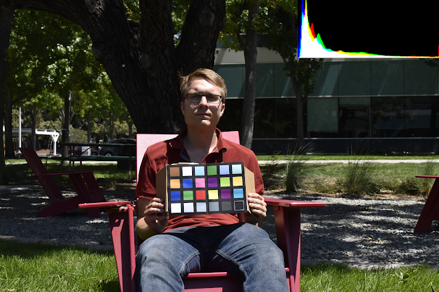
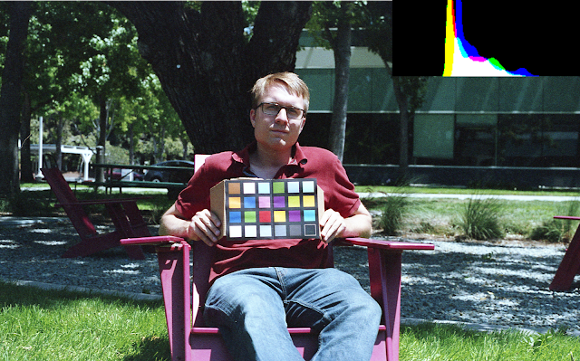
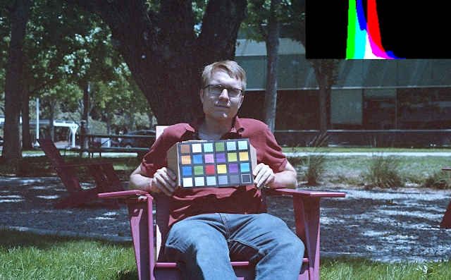
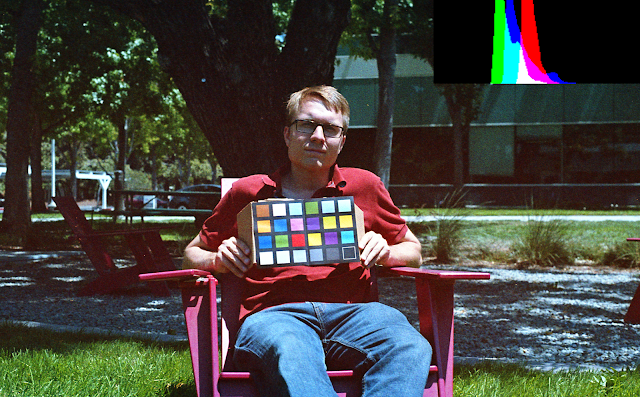
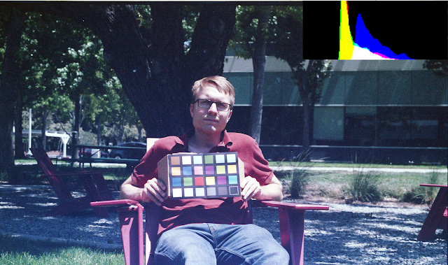
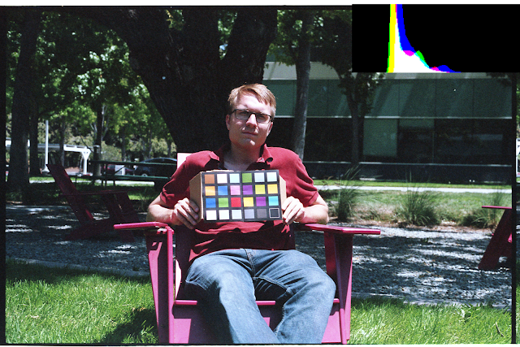
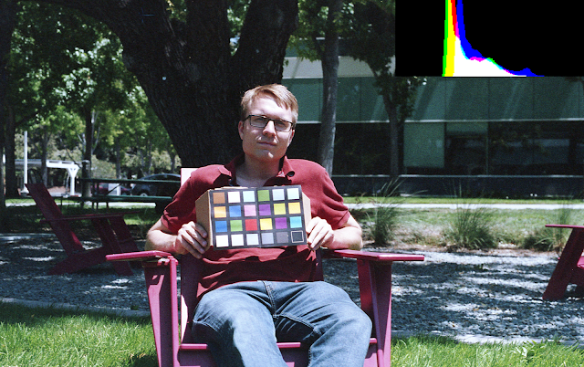
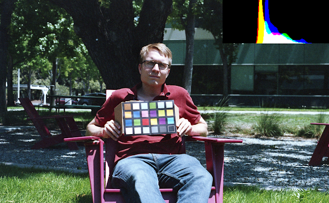

*If you would like to know the procedure used to get these results, see  [part 1 (Procedure)](../1709_myth_color_film_cast_p1/).*

## Reintroduction

I've heard rumors that developing color film (C41) requires holding the  chemical temperature constant ±1℉ for fear the color shift demons will  recolor your film in strange and unusual ways. I developed slices of the same shot at different chemical temperatures to test that claim.

## Results

All pictures were taken at  f/8, 1/1000s, ISO400, including the digital  control. ISO was forced by the film speed I had, aperture was selected  arbitrarily, and shutter speed was set by using the recommended meter  reading of the FE2 film camera.
 The digital control histogram is scaled to the image minimum and maximum.
 The analog histograms are scaled to the minimum and maximum supported density of the scanner.
 This means the analog histograms can be compared with each other fairly but the digital histogram has a different scale.
 All analog pictures were scanned with auto-exposure. The scanner  auto-mapped each RGB channel film densities to image minimum and  maximum.

|  |
| ------------------------------------------------------------ |
| Digital Control (D5600, 35mm f/1.8G)                         |

| |
| ------------------------------------------------------------ |
| 102℉, 3'30" Developer, 6'30" Blix  (Analog Control, recommended settings) |

| |
| ------------------------------------------------------------ |
| 76℉ (Room Temperature), 20'00" Developer, 8'00" Blix. Note: no agitation |

|  |
| ------------------------------------------------------------ |
| *Same as above with color correction                         |

|  |
| ------------------------------------------------------------ |
| 76℉ (Room Temperature), 20'00" Developer, 8'00" Blix. Note: constant agitation |

|  |
| ------------------------------------------------------------ |
| 90℉, 3'45" Developer, 3'45" Blix                             |

|  |
| ------------------------------------------------------------ |
| 90℉, 8'30" Developer, 8'30" Blix                             |

|  |
| ------------------------------------------------------------ |
| 108℉, 4'00" Developer, 6'00" Blix                            |

|  |
| ------------------------------------------------------------ |
| Bonus: identical  Superia 400 slice developed in D76 black and white developer (single  use). This was using the recommended development time (7'00" I think)  and room temperature. |

Comparing the film photos against the digital photo, the digital image  is more vivid and has a higher contrast. The film photos have lifted  shadows. The film photos are bluer than the digital. All of the pictures are slightly under-exposed, perhaps my film camera metering is a bit  off. Going by the 'sunny-16 rule', these shots should all be about 1 ⅓  stops underexposed.

 When in-scanner adjusted for exposure, the color shift is subtle at  best. [76℉] has a mild red shift, and [90℉, 3'45"] photo has a mild  magenta shift.

 Looking at the histograms, temperature affects exposure somewhat. [90℉,  3'45"] is less exposed, but this result disappeared when development  time was adjusted for the lower temperature as in [90℉, 8'30"]. [76℉]  has extreme red positive and green negative color shift, lowered  contrast and less exposure. When agitation was increased only a positive blue color shift existed.

## Conclusion

The **color shifts were minor** for all but the room-temperature 76℉  slices. I believe all color shifts would be correctable in a digital  workflow. Using an analog workflow (printing with an enlarger), the  colors could be corrected to a level I would accept.

I conclude that the color shifts are not as significant as stated, but  developing under the recommended conditions will give you the best  quality.

## Potential Sources Of Error

- Only one film emulsion was tested. It's likely different films will react differently
- Only one chemical kit was tested. Different developers may have different chemical compositions and react differently.
- Agitation level was not carefully controlled. Comparing the results  for 76℉, it seems agitation makes a much bigger difference than  temperature.
- The pictures were underexposed. Perhaps they would have acted  slightly differently if properly exposed, but I doubt it would have made much of a difference.
- The chemicals were reused. Even though C41 chemicals are meant to be reused, they supposedly lose quality or effectiveness after multiple  uses. (An experiment for another day).
- The snippets were developed over the course of multiple days.  Similar to chemical reuse, the mixed chemicals supposedly lose quality  or effectiveness over time.
- I cross contaminated developer into my stabalizer and stabalizer  into my blix. In the first development cycle after the developer, I  poured in a dash of stabalizer before I realized my mistake and replaced it with blix.
- Timing was not kept super accurately. I used a stopwatch on my  phone, but there was latent time between the timer ending and replacing  one chemical for another. I tried to counteract this by reducing the  timer by ~15s.
- Temperature was not finely controlled. After the chemicals and bath  were at the correct temperature, little effort was put into maintaining  that temperature during the development process. As seen in the chart  below, I measured the temperature drift over the course of 10 minutes  and found it to be about 2.5℉, when starting at 101℉. The developer  (recommended 3m30s) and blix (recommended 6m30s) steps must be kept at  the target temperature while stabalizer can be applied at room  temperature. So, I suspect the temperature was stable enough to give  meaningful results.

| Time (s) | Water Temp (F) | Ambient Temp (F) |
| -------- | -------------- | ---------------- |
| 0        | 101.5          | 75.7             |
| 60       | 100.8          |                  |
| 120      | 100.2          |                  |
| 180      | 100.6          |                  |
| 240      | 100.4          |                  |
| 300      | 100            |                  |
| 360      | 99.7           |                  |
| 420      | 99.7           |                  |
| 480      | 99.5           |                  |
| 540      | 99.3           |                  |
| 600      | 99.1           | 79.3             |
