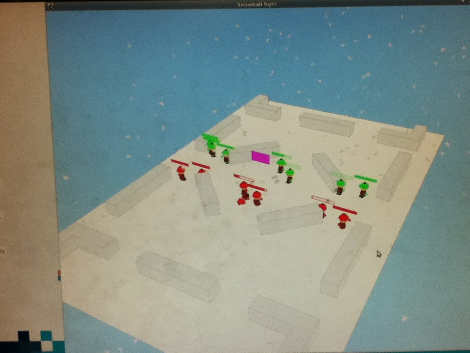

Last weekend I attended the 'CS Games'. The CS Games are a Canadian  computer science competition that, this year, was hosted at ETS in  Montreal. In this post, I will be looking at one of the challenges I  participated in: The AI Challenge.

 Being my first attempt at a CS games event, I had no idea what to  expect. There were 3 people from our school team working on this  challenge, and upon arrival, we were told that we would be writing an AI for a two team capture-the-flag snowball fight. There will be two  teams, each AI controlled by a different university. Each team has seven players and the goal is to steal the flag in the middle of the course,  and bring it back to the starting position, or to knock out all of the  players on the other team. To prevent a rush for the flag, at least 20%  of the players in the game must be knocked out before the flag can be  picked up. Teams will fight a succession of games across a tournament  bracket to see who is the best.

|  |
| ------------------------------------------------------------ |
| The AI Challenge. Two snowballer gangs enter, one leave.     |

The systems provided was a Kubuntu machine with no internet access.  Documentation was provided on a local server. We had two computers to  work on, both with a file-system synced with the logged in user  (uottawa). So, if we changed a file on one computer, it would change the file on the other computer.
 Standard software provided included: gedit, Java, Python, Netbeans,  eclipse, emacs, vim, and anything else you could want for a 3 hour  programming challenge. We were allowed to chose between two languages,  Java or Python. To keep things simple and quick, we decided to develop  with Python using gedit.

 To implement the AI, we were provided with a class representing our  'gang' and needed to implement a single function named 'compute', which  took a world state as a parameter, and returned a list of actions that  our snowballer team would take. The available actions were: throw a  snowball to a destination, move to a
 destination, pick up the flag (if close enough and unlocked), drop the  flag, or do nothing. Each snowballer is only able to take a single  action per frame. Throwing a snowball takes more frames the farther it  is being thrown, but faster moving snowballs also do more damage. The  files provided implemented a server to host a game, and two clients. The clients came with a sample AI that moved around randomly and threw  snowballs in random directions.

 Each challenge at the CS Games are allotted 3 hours to complete. "Plenty of time!" we thought, and got started on thinking up a solution. It  seemed that there were two basic philosophies to chose; either the team  will split up and move independently, or the team will work together  focused on the same thing.
 One idea that came up was to treat the snowballers as boids. Boids are a simple flocking modelled after the movement of swimming fish, and birds in flight. Boid behaviour has three simple rules:

1) Alignment: all boids want to align movement direction with other boids around them;
2) Cohesion: all boids want to keep close to other boids, and move closer if too far away;
3) Separation: all boids want to keep space between them and other boids to

 avoid crowding, and will move away if too close.

 Although the rules are very simple, the behaviour that results is  surprisingly complex. Here is a fairly good demonstration of what boids  are capable of:
[XnaBoids - Swarm Intelligence Demonstration](https://www.youtube.com/watch?v=M028vafB0l8)
 and for more reading on boids, see:
[http://www.red3d.com/cwr/boids/](http://www.red3d.com/cwr/boids/)

 Although boids might be a good candidate for this game, seven  snowballers probably wouldn't be enough for proper flocking; and it  would probably be best to split up to prevent being hit by stray  snowballs intended for a teammate nearby.

 Taking inspiration from our favourite algorithms, we concluded  divide-and-conquer solution would be a good plan. We decided that our  snowballers would split up into squads of two and work on taking out the weak spread out AI our opponents may create, or surround the grouped AI that might be an alternative. From this we decided that 3 squads would  work, two squads of two snowballers, and one squad of three snowballers. This way each squad could also have a unique AI to increase the chance  of one behaviour surviving. Having to implement the 'gang' class, we  started working on rearchitecturing the solution
 so that the gang contained multiple squads, and each squad could have it's own
 AI.

 At first the going was slow. Although we had two computers and could use GIT to collaborate, we were both trying to add features to the same  files and had to wait until the other committed. By the time we figured  out our strategy and got the basic classes up, half our time had already passed! Further time was spent
 getting basic controls going on, and figuring out how to use the API provided.

 One problem that took way too long to get working was the throwing. If a snowballer was told to throw when currently throwing, then the new  throw would interrupt the current throw. Potentially a required  behaviour, but when you have three hours to make something, the 10  minutes needed to figure out why its not
 working, and further time required to fix it, is time spent in  frustration. By the end of the first AI challenge, we had a single two  person squad that moved up to the same y-axis as the flag and throwing  like floppy fishes; not a successful AI. We submitted the sample AI  unmodified, and hoped for the best.
 Perhaps we over-engineered for a challenge of three hours.

 The next day when it was time to start the second round, we were  determined to at least get something working properly. Focusing on the  squad AI that stood next to the flag, we decided to make them into a  'defence squad' by adding logic to have the squad move around the flag  in an orbit, stopping only to throw
 snowballs at any visible enemies. The two squad members would trace a  circle around the flag, each standing on opposite sides of the circle.  This behaviour was added in experimentation, but it ended up being  surprisingly effective.

 After getting the throwing logic working correctly, the squad members  would be able to peg the enemy units with consistency. The two members  of our 'defence' squad were able to take out the entire enemy team of  the sample AI. To be fair, the sample AI were mostly driven by  'math.random', but this still felt like a
 fair achievement for our previously faltering AI.

 In the end, the 'defence' AI worked so well, all squads were assigned  the 'defence' AI, with some modifications were added to orbit at  different distances from the flag for each different squad but otherwise following the same behaviour.

 Furthermore, this flag-grabbing 'defence' AI was told to delay rushing  for the flag. This was added in anticipation of other AI running  straight for the flag as soon as it is available for grabbing, and thus  will be mowed down by our AI on guard.

 In result, our AI got second place out of about thirty teams!  In going  from nothing at the end of the first challenge block to second place at  the end of the second challenge block, I would say that the AI challenge was a success.