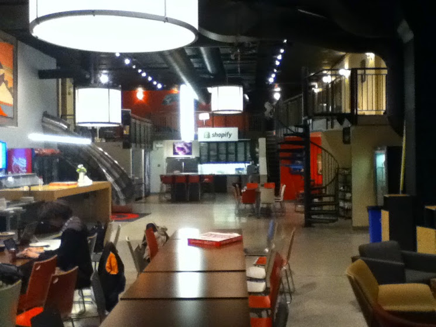
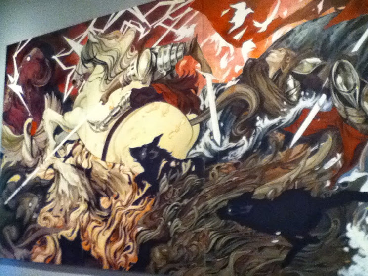
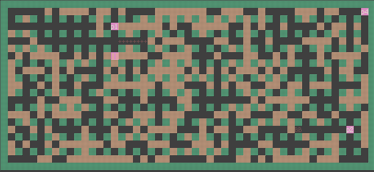

## Unicorns and things

Last Sunday, I attended another AI competition, this one was hosted at the Shopify lounge in Ottawa.

 Firstly, wow, the Shopify lounge is big. It even has a slide between floors! 

|           |
| ------------------------------------------------------------ |
| check out that slide on the left! Unpictured, an arcade machine! |

Among the other impressive features, an arcade machine, full wall mural of a unicorn knight battle, and of course, a free espresso machine. It looked like a delightful place to work on a day to day basis.

|  |
| --------------------------------------------------- |
| Unicorn knights face off!                           |

## Bomberman

Anyways, I wasn't there just to drink fancy lattes and ride slides. The goal of this AI challenge was to create an AI for a bomberman clone. If you have never tried bomberman, go try it. Its quite a fun game. There is a grid of destructible rocks and indestructible walls and the point is to lay down bombs to destroy rocks and catch the enemy players in an explosion.

| -3.png) |
| ------------------------------------------------------------ |
| Place bombs, explode stuff (except yourself)                 |

The bomberman implementation used can be found at [on github](https://github.com/aybabtme/bomberman)
 This version of bomberman only has 2 powerups; number of bombs and radius of explosions. This would make logistics easier,
 Provided for choice were 3 clients: one for python, one for java, one for ruby.
 Since I knew Java best, I ended up using the provided Java client found [on github.](https://github.com/aybabtme/bombjava)

 It had been a long time since I last used Java for any project, since most of my side-projects are written in C or C++. I think it might have been over 2 years since last touching Java, but it was easy to slip back into. Fortunately since I only needed to hack out something quickly, I didn't need to approach much of the more annoying side of Java; No [AbstractSingletonProxyFactoryBeans](http://docs.spring.io/spring/docs/2.5.x/api/org/springframework/aop/framework/AbstractSingletonProxyFactoryBean.html) were needed, but checked exceptions of course made their unwelcome appearance in such a simple application.

## The Implementation

To keep things simple, I created two classes:  a 'Bomberman' main class to connect to the server, get updates and send back responses, and a Player class with a single externally important method 'update', which would return a single move computed for the turn.

 Each turn the server will send over a json snippet containing the contents of each of the cell's of the map, and it was the Java client's responsibility to throw all of that information into a 'GameState' object that could be queried by my player.

 The GameState contained an 2D array if cells representing the game board. Each cell could contain one of a set of choices:

- a wall
- ground (aka nothing)
- a rock
- a bomb
- flame
- a powerup to increase the amount of placable bombs
- a powerup to increase radius of placable bombs

below can be seen an image of the bomberman implementation used. 

|  |
| ------------------------------------------------------------ |
| Green are unbreakable walls, brown are breakable rocks. Also visible are the  players (marked as p1, p2, p4), bombs (marked as BB) and flames from an  explosion (marked as +) |

### Ideas and Things

With everything ready to go, I needed to think of a strategy for my AI. One idea I had was to have a 'grenade' AI. In the traditional game of bomberman, there is a powerup to pick up and throw bombs. This would have allowed me to create an AI that would cook a bomb and throw it at a nearby enemy for a near guaranteed kill. Unfortunately, with the simplified powerup list, that would not be possible.

 Another possibility would be to do a whole Minimax search tree for the best possible move. The basic concept of a minimax AI is that the AI would predict the game state multiple turns into the future, score each choice on a decision criteria, and chose the move that produces the best likely outcome in the future. The term 'minimax' comes from smashing together the two words 'minimize' (for minimizing positive outcome from enemy moves), and 'maximize' (for maximizing positive outcomes from our own moves). For such a simple game as bomberman, this might have worked, but I only had 12 hours to work on my AI and I had never implemented a Minimax AI before. I thought it easier to stick with what I know. For a more in depth explanation of minimax AI, check out [this link.](http://www.flyingmachinestudios.com/programming/minimax/)

 Instead of minimaxing, maybe I could aim trap an enemy, or maybe I could simply run up to an enemy and surround them with as many bombs as possible and run away, The hit-and-run approach. This seemed like a good idea for its simplicity. It would be kind of like 'Blinky's AI from Pacman, except with more explosions

 ([heres a good explanation](http://gameinternals.com/post/2072558330/understanding-pac-man-ghost-behavior) of Pacman ghost AI; Check out the red ghost)

 With a basic concept in mind, the first order of business for my AI was to get some sort of simple path finding working. Without path finding, the AI would be a sitting duck and wouldn't be able to hit nor run.
 I decided that to get things working best, I would anotate the provided Cells. For every single cell of the map, I would find the distance to the player, the number of rocks that would need to be destroyed to reach that position, and the next step needed by the player to go in the direction of this cell. For this, I used a simple graph traversal. I created a graph of 'AnnotationCells', initializing their distance to infinity, and I recursively visited all neighbour cells and noted their current distance. It was a simple depth-first graph traversal, where I noted down the required parameters. Once this was done, I was then able to inspect any cell (along with it's annotation) and know the next step I need to make to get to that cell. Yes, the solution is pretty computationally expensive, but I figured in a hackathon, keeping it simple is more important than performance.

### Bombs and Not Blowing Up

Next I needed to find a way through rocks while pathing. I figured the easiest way would be to deal with them when I reach them. So, if the pathing algorithm would tell me to path into a rock, then place a bomb.
 Now I had the issue of dodging bombs. The solution I decided on was to add another field to my annotation, a 'danger' factor. A cell is dangerous if it is within 5 direct spaces from a bomb. Then I added another behaviour to my pathing. If the cell he is in or the one he is going to is dangerous, then run to the closest safe place. This required another yet another graph traversal, this time limited to the few cells around the AI. This traversal would find the closest 'safe' tile.

 I could place more than bomb at once to blow up more walls, but I figured it would be easiest to only place a single bomb at a time to guarantee a path to a safe place.

### Rounding Corners

At this point, I had a bomberman that correctly pathed to a given square, and avoided bombs. Fairly promising. It had only taken the first 5 or 6 hours to get to this point. But, one thing I noticed was that he sometimes had problems rounding corners.

 The corner rounding issue took way too much time. Over hours of experimentation and debugging, I had discovered that the cause was the way the client and server communicated. The server would enqueue updates for future frames, and would buffer moves. So, If I told the server I wanted to go forward this turn, it might take 3 of 4 turns to actually move. In this case, I see myself at the same position and send more messages to go forward. This causes my character to overshoot the turning target, and would try to turn around causing the character to again overshoot the turn. The character would then osculate around the turn, and never get anywhere.
 I was not able to fix this issue, since it was unknown how many turns it would take for the move to be scheduled by the server, and some times would be missed altogether. In the end, I had to compromise by having the AI update less often.

### The Dance Off

Finally it was time for the versus. There were 4 AI's that were deemed complete, and it was set up so that they would all face each other at once. It was set up so all of the AI's were run on a single laptop, which also hosted the server. After a few minutes of messing around with configurations, the server and all of the AI were running.

 I expected my AI to be able to path, drop bombs, maybe get stuck up on a corner or two, but my AI along with all of the others seemed to have cold feet. My AI danced back and forward between two starting squares. Two of the other AI's managed to blow themselves up, and one other AI managed to join me dancing.

### Conclusion

So, it was a tie in the end. Despite all our hard work, none of the AI's managed to work correctly in the end. I tried changing some parameters before running him again on the competition computer, but to no avail. In retrospect, I believe that my AI was stuck not on path finding, but because his target kept changing. I set the path target to be the first character in a list, but perhaps as he moved forward the list was generated in a different order, even though I sorted the list before using. He didn't seem to dance strangely before because there were only 2 other characters on the board for testing.

 Anyways, it was a pretty fun event regardless of my silly AI clamming up for his big performance. Hopefully there will be another AI event in the future. 

### The Source

Full source code of my AI can be found on [github](https://github.com/bsurmanski/bomberman_ai). Along with [The Go server](https://github.com/aybabtme/bomberman) And [The Java client](https://github.com/aybabtme/bombjava)