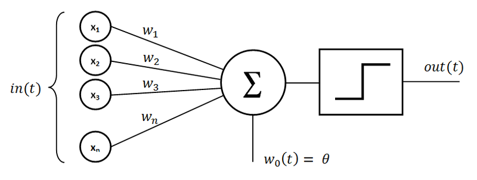
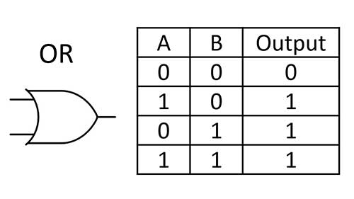
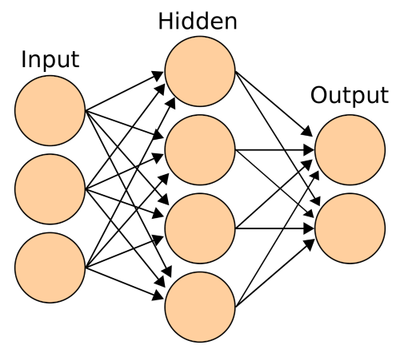

### Trained for a specific task, Neural Networks are like specialized virtual computers

I've been thinking about neural networks quite a bit lately. I recently read an article  ([this one](https://www.blogger.com/#) actually) that did an excellent job at explaining exactly how neural networks work, and went on to give an example of optical character recognition (OCR) using a neural network.

 Neural Networks really aren't as complicated as I previously thought. There are a few different types of digital neurons used in neural networks. The most popular being perceptrons, and sigmoid neurons. The idea behind perceptrons is that the perceptron can have any number of weighted inputs, and has a single output which acts like a step function dependant on the weighted sum of the inputs.

|  |
| ------------------------------------------------------------ |
| The function of a perceptron artificial neuraon.   The output (t) is only on if the sum of it's weighted inputs (x1 .. xn),   plus some bias (w0) is greater than some threashold.    (Image from Wikimedia Commons) |

One example might be the case where there are two inputs 'A' and 'B', both with weights of 1, bias of 0 and threshold on 1. Normally, perceptrons allow analog inputs, but if we limit the inputs to be digital values of 0 or 1, this perceptron forms a function. Below is the truth table:

|  |
| --------------------------------------- |
| OR function truth Table                 |

If you're familiar with computers and boolean logic, you might recognize the function this truth table forms. It is the boolean OR function. There are a handful of various basic boolean functions: OR, NOR, XOR, AND, NAND, NOT, and perhaps a handle of other less useful functions. In fact, all of these functions can be implemented using a single perceptron, just by modifying the perceptrons weights and threshold; for example a NAND function is made with weights of -1 and -1, and a threshold of -2. Those familiar with computer design might already realize why this is so important. These function are often implemented in discrete computer chips, or in integrated circuits where an instance is known as a 'gate'. It has been proven that any computable operation possible can be produced by some combination of these boolean logic gates. In fact, addition of 8 bit numbers can be done by connecting together 8 single bit adder circuits, where each single bit adder contains only 5 logic gates for a grand total of 40 logic gates for 8 bit addition. And this addition circuit would scale up by adding more adding more single bit adders. This is basically what every modern CPU's does (with various optimisations added). And its not just addition, the entire functional component of a CPU is created by wiring together a great number of these logic gates. And since these artificial neutrons, perceptrons, can effectively be used as any logic gate, it is thus possible to create an entire computer out of these perceptrons.

 To actually get neural networks to do what you want, they are 'trained'. First, a really large network of these perceptrons are connected together, forming a web. Then, the network is 'trained' by defining some target and tweaking the weighted edges between the perceptrons until the network as a whole approximates the function desired. With the single perceptron example if we wanted to create a NAND function, the trainer would be provided the truth table for NAND and would modify the two input weights and the thresholds until the perceptron itself acted like the truth table. And this can be scaled up, to do very complicated things. A common example use for neural networks is character recognition; creating a neural network that recognizes which character is scribbled in an image.

|  |
| ------------------------------------------------------------ |
| A simple neural network with 3 inputs and two outputs.   A trainer program would strengthen or weaken the connections  between nodes to closer approximate the target function. |

Essentially, a neural network is a custom virtual computer designed to compute exactly what you tell it to. And I think that is very cool.