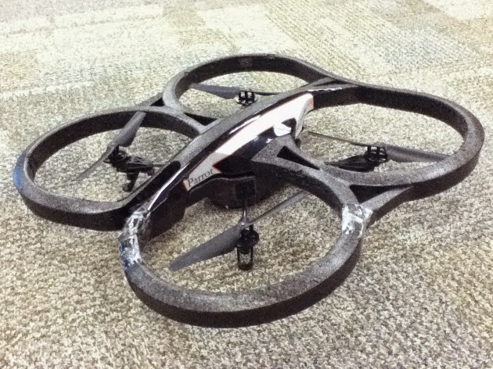
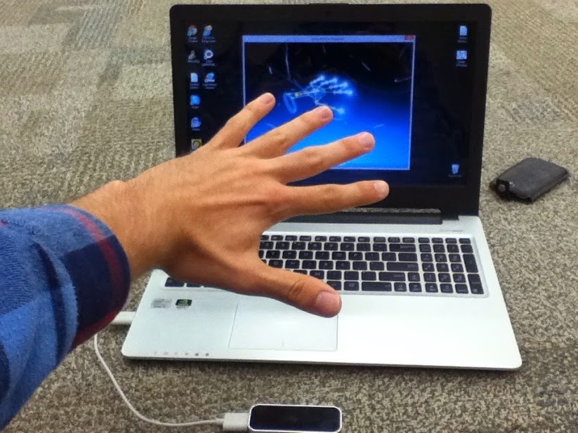
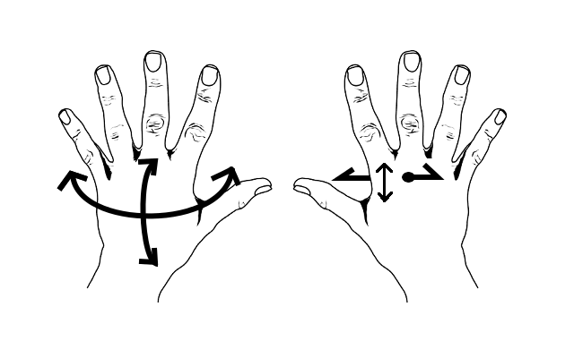

Recently I went to an event entitled 'NodeBots'. If you've ever heard of Node.js, you might already see where this is going. The event describes itself as "Robots powered by JavaScript". Anyone even vaguely familiar  with JavaScript will know that it is mainly used for websites. More  specifically, it is used for client-side scripting of websites. Plainly, this means a web page can run code on your computer to power the fancy transition effects of  drop down menus and all the other dynamic actions of the Web 2.0(!). Anyone  familiar with JavaScript knows it has a bit of a controversial reputation. As a  language, it has very little static checking and will keep on chugging even when an  error is encountered. This can make it quite difficult to debug. So it might seem a little strange that the idea of this event is to control robots using  JavaScript.The idea is that participants use a popular JavaScript  platform called 'Node.js'. Node.js is a platform that allows JavaScript programs to run natively, eschewing the requirement for a web browser. Explaining why  anyone would want native JavaScript is a bit complicated and is beyond the  scope of this post.
 I took the NodeBots opportunity to get familiar with JavaScript, and use it to control a quadcopter. A quadcopter essentially being a miniature helicopter, with 4 rotors instead of the traditional set up of a main rotor and a tail. These four rotors are places at the corners of the 'drone' such that it can tilt in any direction to control pitch and yaw, and causing it to drift in the tilted direction.
 Note that when I use 'drone' above, I mean an unmanned aerial vehicle. The military uses much larger and deadlier 'drones' but the one I was playing with was the size of a garbage can lid and completely unarmed. Also note that 'unmanned' does not imply automated, since I was in fact controlling the drone with a 'Leap Motion'.

|  |
| ------------------------------------------------------------ |
| Quadcopter drone used NodeBots event.                        |

## Leap Motion

One of the main components in this build was the Leap Motion.  The leap motion is a small devices about slightly larger than a Tic-Tac container, that can be used to detect orientation and pose of a user's hands.  Using a Leap Motion really feels like sometime recently we have slipped seamlessly into the future. It can detect a swipe, fist, count fingers, whatever I can think of. It's one problem is that it isn't too accurate. The accuracy is a bit shakey, and often it will jitters a finger out of sensing existence for a split second.  On top of that, since it is projecting a sensor upward, if my hands overlap it cannot figure out the orientation of my hands.
 Despite all of this, it worked perfectly fine for flying a drone. No finicky hand movements were required, no fingers need be counted. All that was needed was for the Leap Motion to track the orientation and rough position of the palm of my hand.

|  |
| ------------------------------------------------------------ |
| Example of Leap Motion(TM) detecting hand orientation and pose.  The Leap Motion hardware can be seen as the black box at the bottom of the image. |

## Controlling the Drone

I set up the following to control the drone:

- The drone will take off when the leap motion detects hands in its field of view.

- The drone will land when there are no longer hands in its field of view.

- Left hand controls the pitch and roll. Hold the left hand out and tilt the hand in the relevant direction.

- Right hand controls the height and yaw. The height is controlled by raising the right hand higher or lower relative to the left hand.

- The yaw is controlled by moving the right hand forward or backward relative to the left hand.
   

  | ]     |
  | ------------------------------------------------------------ |
  | Diagram showing the controls used for the drone.  A leap motion would detect hand movements and convert them to commands for the drone. |

## The Experience

Controlling the drone was surprisingly difficult. One would think that controlling things with a wave of their hand would be the most natural and easy way to do so. It would be reasonable to think that the drone would act like an extension to the body, transcending the unnatural button mashing of the more traditional controller scheme. Unfortunately, the Leap Motion simply turned my hands into the controller. The same difficulty of learning a new control scheme persisted. Although by the day's end I was quite skilled and flying the drone around without too many accidents, a standard controller would likely win out on user interface usability.

## Code and Credits

Code is available on my [GitHub account](http://www.github.com/bsurmanski/leapDrone).
 Credits to [Robert Wood](http://github.com/Doowybbob), and [Brandon Surmanski](http://github.com/bsurmanski) (me).